# ScamSense

Multi-Agent AI Scam Detection System using FastAPI, LangGraph, Google Gemini 1.5 Pro, Elasticsearch, PostgreSQL, and Redis.

## Project Structure

```
scamshield/
├── main.py                 # All-in-one version
├── main_modular.py         # Modular version
├── requirements.txt
├── .env.example
├── config/                 # Settings
├── models/                 # Pydantic models
├── services/               # Database clients
├── agents/                 # LangGraph agents
├── api/                    # FastAPI routes
├── scripts/                # Setup scripts
├── frontend/               # Dashboard
└── tests/                  # Test files
```

## Quick Start

```bash
python -m venv venv
venv\Scripts\activate
pip install -r requirements.txt
copy .env.example .env
python scripts/init_database.py
python scripts/init_elasticsearch.py
python main.py
```

## Agent Pipeline

Watcher -> Analyzer -> Pattern -> Alerter -> Blocker

## API Endpoints

- POST /api/v1/auth/register
- POST /api/v1/auth/login
- POST /api/v1/analyze
- GET /api/v1/scams
- GET /api/v1/stats
- POST /api/v1/report
- WS /ws/{user_id}

## Environment Variables

```
GEMINI_API_KEY=AIza...
DATABASE_URL=postgresql://...
ES_CLOUD_ID=...
ES_API_KEY=...
REDIS_URL=redis://...
JWT_SECRET=...
```

---

# 🛡️ System Architecture & Documentation

## 1. High-Level Architecture

ScamShield follows a **Microservices-inspired Monolith** pattern, designed for high throughput and modularity.

```mermaid
flowchart TD
    User["User (Mobile/Web)"] -->|HTTPS/WSS| GlobalLB["Global Load Balancer (Render)"]
    
    subgraph BackendCore ["Backend Core (FastAPI)"]
        GlobalLB --> API["API Gateway"]
        API --> Auth["Authentication Service (JWT)"]
        API --> WSS["WebSocket Manager"]
        
        API --> Orchestrator["LangGraph Orchestrator"]
    end
    
    subgraph AIAgentLayer ["AI Agent Layer"]
        Orchestrator --> Watcher["👁️ Watcher Agent"]
        Orchestrator --> Analyzer["🧠 Analyzer Agent (Gemini 1.5 Pro)"]
        Orchestrator --> Pattern["📊 Pattern Agent"]
        Orchestrator --> Alerter["🚨 Alerter Agent"]
        Orchestrator --> Blocker["🛡️ Blocker Agent"]
        
        Analyzer -.-> Gemini["Google Gemini API"]
    end
    
    subgraph DataLayer ["Data Layer"]
        Auth --> Postgres["PostgreSQL (Supabase)"]
        Blocker --> Postgres
        Pattern --> Elastic["Elasticsearch (Vector DB)"]
        WSS -.-> Redis["Redis (Cache & Pub/Sub)"]
    end
    
    style User fill:#f9f,stroke:#333,stroke-width:2px
    style BackendCore fill:#e1f5fe,stroke:#0277bd,stroke-width:2px
    style AIAgentLayer fill:#fff3e0,stroke:#ef6c00,stroke-width:2px
    style DataLayer fill:#e8f5e9,stroke:#2e7d32,stroke-width:2px
```



## 2. The Analysis Workflow (Sequence Diagram)

This diagram shows exactly what happens when a user receives a suspicious message. The entire process completes in **under 2 seconds**.


## 3. Deployment Topology

How the system is actually hosted and connected online.


