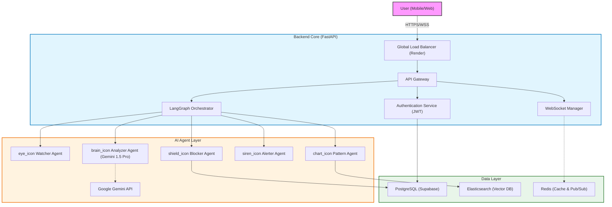
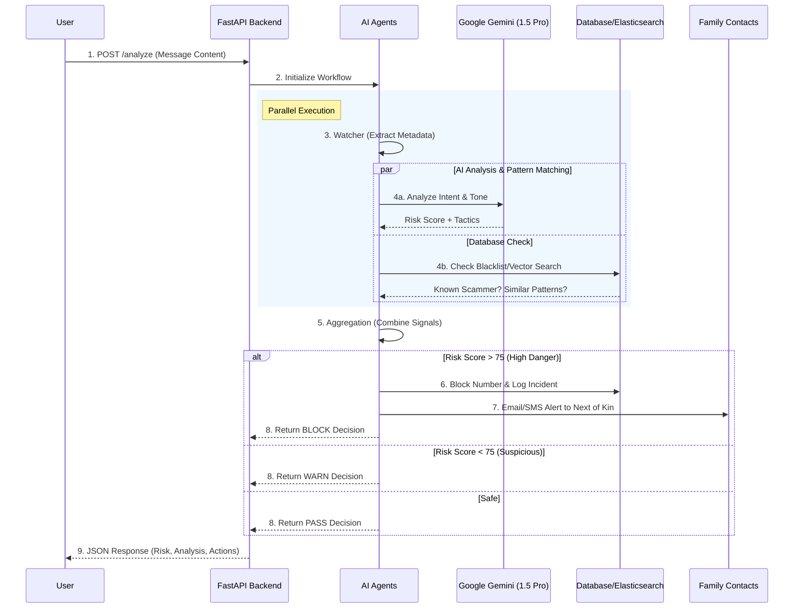
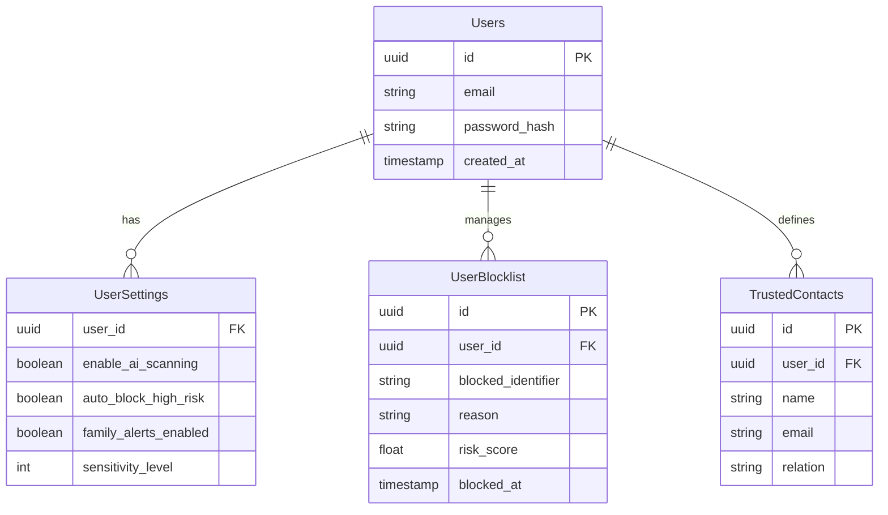
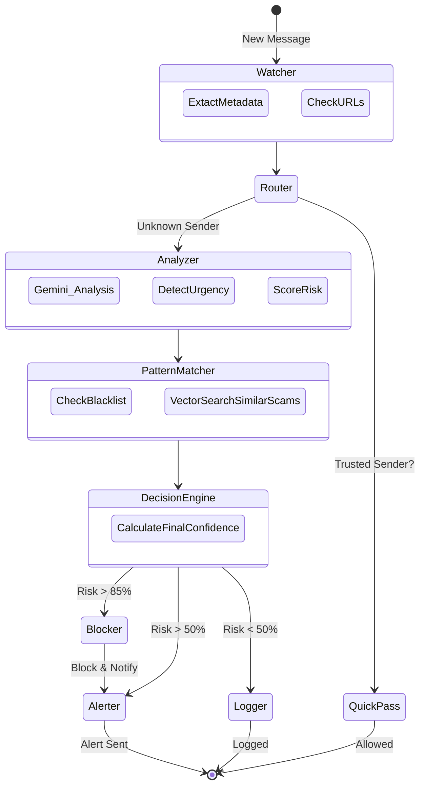
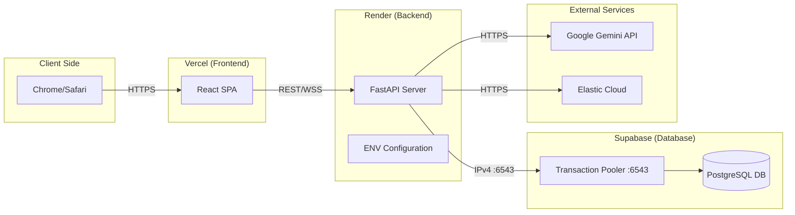

# 🛡️ ScamShield System Documentation

An in-depth technical overview of the ScamShield system, featuring architecture diagrams, data flows, and component breakdowns.

---

## 1. High-Level Architecture

ScamShield follows a **Microservices-inspired Monolith** pattern, designed for high throughput and modularity.

---

## 2. The Analysis Workflow (Sequence Diagram)

This diagram shows exactly### ⚡ Why FastAPI?
We need **asynchronous** processing to handle thousands of messages per second without blocking. Python's `asyncio` combined with FastAPI gives us Node.js-like concurrency with Python's AI ecosystem (Google Generative AI SDK, LangChain).
The entire process completes in **under 2 seconds**.

---

## 3. Database Schema (Entity Relationship)

ScamShield uses **PostgreSQL** for relational data (users, settings) and **Elasticsearch** for unstructured data and vector search.

---

## 4. Agent State Machine (LangGraph)

The AI logic isn't just a straight line; it's a state machine that can loop or branch based on findings.

---

## 5. Deployment Topology

How the system is actually hosted and connected online.

---

**Generated by Antigravity for ScamShield**
