# 🛡️ ScamShield (ScamSense) — Complete Project Walkthrough

> **Multi-Agent AI Scam Detection System** built with **LangGraph + Gemini + FastAPI + PostgreSQL + Elasticsearch + Redis**

---

## 🏗️ High-Level Architecture


### Data Flow Summary

1. **User submits** a suspicious message via the frontend
2. **API** validates the request, checks rate limits (Redis), and starts the **LangGraph workflow**
3. **5 agents execute sequentially**: Watcher → Analyzer → Pattern → Alerter → Blocker
4. **Result** (BLOCK/WARN/PASS) is returned to the user with risk score, detected tactics, and explanation

---

## 📁 Project File Map

| Directory | Purpose |
|-----------|---------|
| `/` | Entry point, config, deployment |
| `agents/` | 5 AI agents forming the detection pipeline |
| `api/` | FastAPI routes + WebSocket |
| `config/` | Centralized settings via Pydantic |
| `models/` | Pydantic data models |
| `services/` | Database, Elasticsearch, Redis, Gemini clients |
| `scripts/` | DB/ES initialization & seeding |
| `tests/` | Unit tests for agents, API, Elasticsearch |
| `frontend/` | Single-page dashboard UI |

---

## 📄 Root Files

### [main_modular.py](file:///c:/Users/omsai/Downloads/hackthon%20project/scamshield/main_modular.py) — **App Entry Point**

**The heart of the application.** This file:

1. **Creates the LangGraph workflow** — connects all 5 agents in a linear pipeline:
   ```
   START → Watcher → Analyzer → Pattern → Alerter → Blocker → END
   ```
2. **Manages the app lifecycle** (`lifespan`) — initializes PostgreSQL, Elasticsearch, Redis, and Gemini LLM on startup; closes all connections on shutdown
3. **Creates the FastAPI app** with CORS middleware (allows all origins), mounts API routes, WebSocket endpoint, and static frontend files
4. **Runs with Uvicorn** on port 8000

### [requirements.txt](file:///c:/Users/omsai/Downloads/hackthon%20project/scamshield/requirements.txt) — **Dependencies**

Key packages: `fastapi`, `uvicorn`, `langgraph`, `langchain-google-genai`, `asyncpg`, `elasticsearch[async]`, `redis`, `python-jose`, `passlib`

### [Procfile](file:///c:/Users/omsai/Downloads/hackthon%20project/scamshield/Procfile) — **Deployment**

Runs the app via Uvicorn on Render: `web: uvicorn main_modular:app --host 0.0.0.0 --port $PORT`

### [runtime.txt](file:///c:/Users/omsai/Downloads/hackthon%20project/scamshield/runtime.txt) — Python 3.11.0

### [.env.example](file:///c:/Users/omsai/Downloads/hackthon%20project/scamshield/.env.example) — **Environment Template**

All required env vars: `GEMINI_API_KEY`, `DATABASE_URL`, `ES_CLOUD_ID`, `ES_API_KEY`, `REDIS_URL`, `JWT_SECRET`, thresholds

### [test_db.py](file:///c:/Users/omsai/Downloads/hackthon%20project/scamshield/test_db.py) — **DB Connection Tester**

Standalone script to verify PostgreSQL connectivity. Includes SSL setup, Windows event loop fix, and troubleshooting hints for common errors (password, timeout, DNS).

---

## ⚙️ Config Module

### [config/settings.py](file:///c:/Users/omsai/Downloads/hackthon%20project/scamshield/config/settings.py) — **Centralized Settings**

Uses `pydantic-settings` to load all configuration from `.env`:

| Setting | Default | Purpose |
|---------|---------|---------|
| `GEMINI_MODEL` | `gemini-2.0-flash` | AI model for scam analysis |
| `GEMINI_TEMPERATURE` | `0.1` | Low temperature for consistent outputs |
| `RISK_SCORE_BLOCK_THRESHOLD` | `70` | Score ≥70 → auto-BLOCK |
| `RISK_SCORE_WARN_THRESHOLD` | `40` | Score ≥40 → WARN |
| `JWT_EXPIRY_MINUTES` | `15` | Token lifetime |
| `RATE_LIMIT_PER_MINUTE` | `100` | Max API calls per user/minute |
| `DB_POOL_MIN/MAX_SIZE` | `5/20` | PostgreSQL connection pool |

The `@lru_cache` decorator ensures `Settings` is instantiated only once.

---

## 📦 Models Module

### [models/scam.py](file:///c:/Users/omsai/Downloads/hackthon%20project/scamshield/models/scam.py) — **Core Data Types**

- **`AgentState`** (TypedDict) — The shared state that flows through ALL 5 agents. Contains 22 fields including `message`, `sender`, `risk_score`, `analysis`, `detected_tactics`, `known_scammer`, `blocked`, `final_decision`, etc.
- **`AnalysisResponse`** — API response with `risk_score` (0-100), `decision` (BLOCK/WARN/PASS), `analysis` dict, `actions_taken`, `processing_time_ms`
- **`ScamReport`** — User-submitted scam report
- **`StatsResponse`** — Dashboard stats: `total_blocked`, `blocked_today`, `top_scam_types`, `protection_score`

### [models/message.py](file:///c:/Users/omsai/Downloads/hackthon%20project/scamshield/models/message.py) — **Message Models**

- **`MessageAnalyzeRequest`** — Input: `message` (1-5000 chars) + `sender`
- **`WatcherOutput`** — Cleaned message with extracted URLs, phone numbers, emails

### [models/user.py](file:///c:/Users/omsai/Downloads/hackthon%20project/scamshield/models/user.py) — **User Models**

- **`UserCreate`** — Registration: `email` (validated), `password` (min 8 chars), optional `phone`
- **`UserLogin`** — Login: `email` + `password`
- **`UserSettings`** — Preferences: alert methods, aggressive blocking, family alerts
- **`TrustedContact`** — Family/friends to notify on scam detection

---

## 🤖 Agents Module — The AI Pipeline

All 5 agents share the `AgentState` TypedDict. Each agent reads the state, does its work, and returns an updated state.

```mermaid
graph LR
    START(("📨 Message In")) --> W["🔍 Watcher"]
    W --> A["🧠 Analyzer"]
    A --> P["📊 Pattern"]
    P --> AL["🚨 Alerter"]
    AL --> B["🚫 Blocker"]
    B --> END(("✅ Result"))
    
    style W fill:#3b82f6
    style A fill:#8b5cf6
    style P fill:#f59e0b
    style AL fill:#ef4444
    style B fill:#10b981
```



---

### [agents/watcher.py](file:///c:/Users/omsai/Downloads/hackthon%20project/scamshield/agents/watcher.py) — **Agent 1: The Watcher** 🔍

**Job:** Pre-process the incoming message.

- **`extract_urls()`** — Regex-based URL extraction, handles `http/https` links + shortened URLs (`bit.ly`, `goo.gl`, `t.co`, `tinyurl.com`)
- **`extract_phone_numbers()`** — Finds US-format phone numbers
- **`clean_content()`** — Replaces URLs with `[URL]` placeholder, normalizes whitespace
- **`watcher_agent()`** — Combines the above, adds `processing_start` timestamp

**Output:** `urls`, `content_cleaned`, `processing_start` added to state

---

### [agents/analyzer.py](file:///c:/Users/omsai/Downloads/hackthon%20project/scamshield/agents/analyzer.py) — **Agent 2: The Analyzer** 🧠

**Job:** Use Google Gemini AI to analyze the message for scam tactics.

- **Sends the message** to Gemini with a detailed system prompt that checks for 7 manipulation tactics: URGENCY, AUTHORITY, THREATS, TOO_GOOD, SUSPICIOUS_URLS, EMOTIONAL, INFO_REQUEST
- **`parse_llm_response()`** — Robust JSON parser that handles markdown code blocks, Python-style dicts, and raw JSON extraction via regex
- **Retry logic** — 3 retries with exponential backoff (5s, 10s, 20s) for rate-limiting (HTTP 429)
- **`fallback_analyze()`** — **Critical fallback!** If Gemini is completely unavailable, uses keyword-based scoring:
  - Urgency words (+20), Authority words (+25), Threat words (+25), Too-good words (+20), Info requests (+20), Suspicious URLs (+15) — capped at 100

**Output:** `risk_score`, `analysis`, `detected_tactics`, `confidence` added to state

---

### [agents/pattern.py](file:///c:/Users/omsai/Downloads/hackthon%20project/scamshield/agents/pattern.py) — **Agent 3: The Pattern Matcher** 📊

**Job:** Cross-reference against Elasticsearch databases of known scammers, malicious URLs, and scam patterns.

- **`search_scam_number()`** — Checks if sender is in `scam_numbers` index
- **`search_malicious_url()`** — Checks if any extracted URL is in `reported_urls` index
- **`search_similar_patterns()`** — Fuzzy-matches message text against `scam_patterns` index
- **`calculate_pattern_confidence()`** — Scoring:
  - Known scammer: +40 points
  - Malicious URL: +30 points
  - Similar patterns: +10 per match (max 30)
  - Previous reports: +0.5 per report (max 20)

**Output:** `known_scammer`, `previous_reports`, `similar_patterns`, `url_malicious`, `pattern_confidence` added to state

---

### [agents/alerter.py](file:///c:/Users/omsai/Downloads/hackthon%20project/scamshield/agents/alerter.py) — **Agent 4: The Alerter** 🚨

**Job:** Determine if the user needs to be alerted and send real-time notifications.

- **`should_alert()`** → Returns `True` if risk_score > 70 OR pattern_confidence > 70 OR known_scammer OR url_malicious
- **`should_warn()`** → Returns `True` if max(risk, pattern) > 40 but not alert-level
- **Sends WebSocket alert** to the connected user in real-time with alert type (`SCAM_BLOCKED` or `SCAM_WARNING`), sender, risk score, tactics, timestamp

**Output:** `alerted`, `channels_used`, `family_notified` added to state

---

### [agents/blocker.py](file:///c:/Users/omsai/Downloads/hackthon%20project/scamshield/agents/blocker.py) — **Agent 5: The Blocker** 🚫

**Job:** Take final protective action based on all previous agents' findings.

- **`determine_decision()`** — Final verdict using `max(risk_score, pattern_confidence)`:
  - `> 70` OR known scammer OR malicious URL → **BLOCK**
  - `> 40` → **WARN**
  - Otherwise → **PASS**
- **On BLOCK:**
  1. Adds sender to user's PostgreSQL blocklist (`user_blocklist` table)
  2. Logs the incident to Elasticsearch (`incident_logs` index)
  3. Updates the community scam database in Elasticsearch (`scam_numbers` index)
- **On WARN:** Only logs the incident
- **On PASS:** No action, marks as "passed"
- **`hash_message()`** — SHA-256 hashes message content for privacy in logs

**Output:** `final_decision`, `blocked`, `logged`, `community_updated`, `actions_taken` added to state

---

## 🔌 Services Module

### [services/gemini_client.py](file:///c:/Users/omsai/Downloads/hackthon%20project/scamshield/services/gemini_client.py) — **Gemini AI Client**

- Initializes `ChatGoogleGenerativeAI` from `langchain-google-genai` with the configured model, temperature, timeout (60s), and retries (3)
- **`SCAM_ANALYSIS_SYSTEM_PROMPT`** — Detailed prompt instructing Gemini to check for 7 scam tactics and respond in strict JSON format
- **`get_analysis_prompt()`** — Formats the user message with sender info and extracted URLs

### [services/database.py](file:///c:/Users/omsai/Downloads/hackthon%20project/scamshield/services/database.py) — **PostgreSQL Client**

- Creates an `asyncpg` connection pool with SSL (cert verification disabled for cloud providers)
- Fixes `postgres://` → `postgresql://` for asyncpg compatibility
- Helper functions: `execute_query()`, `fetch_one()`, `fetch_all()`, `fetch_value()` — all gracefully handle missing DB

### [services/elasticsearch_client.py](file:///c:/Users/omsai/Downloads/hackthon%20project/scamshield/services/elasticsearch_client.py) — **Elasticsearch Client**

Manages 4 indices:

| Index | Purpose |
|-------|---------|
| `scam_numbers` | Known scam phone numbers with report counts |
| `scam_patterns` | Text patterns of known scam messages (fuzzy searchable) |
| `incident_logs` | Every analyzed message with decision and timing |
| `reported_urls` | Known malicious/phishing URLs |

Key operations: `search_scam_number()`, `search_malicious_url()`, `search_similar_patterns()`, `log_incident()`, `update_scam_number()`, `get_user_stats_aggregation()`

### [services/redis_client.py](file:///c:/Users/omsai/Downloads/hackthon%20project/scamshield/services/redis_client.py) — **Redis Client**

Three features:

1. **Rate limiting** — `check_rate_limit()`: Per-user, 100 requests/minute using Redis INCR + EXPIRE
2. **Caching** — `cache_set()` / `cache_get()` / `cache_delete()`: Generic JSON cache with TTL (default 5 min)
3. **Sessions** — `store_session()` / `get_session()` / `delete_session()`: User session storage with 15-min TTL

---

## 🌐 API Module

### [api/routes.py](file:///c:/Users/omsai/Downloads/hackthon%20project/scamshield/api/routes.py) — **REST API Endpoints**

| Method | Endpoint | Auth | Purpose |
|--------|----------|------|---------|
| `POST` | `/api/v1/auth/register` | ❌ | Create account (email + password) |
| `POST` | `/api/v1/auth/login` | ❌ | Login, returns JWT token |
| `POST` | `/api/v1/analyze` | ✅ | **Core endpoint** — analyze a message through all 5 agents |
| `GET` | `/api/v1/scams` | ✅ | Get user's blocked scams list (paginated) |
| `GET` | `/api/v1/stats` | ✅ | Dashboard stats (total blocked, today, protection score) |
| `POST` | `/api/v1/report` | ✅ | Manually report a scam sender |

**Authentication:** JWT Bearer tokens using `python-jose` (HS256). Passwords hashed with `passlib` (PBKDF2-SHA256). 15-minute token expiry.

**`/api/v1/analyze` flow:**
1. Verify JWT → Extract `user_id`
2. Check rate limit via Redis
3. Build `AgentState` with 22 initial fields
4. Invoke the LangGraph workflow (`ainvoke`) — all 5 agents run sequentially
5. Return `AnalysisResponse` with risk score, decision, analysis details, actions, processing time

### [api/websocket.py](file:///c:/Users/omsai/Downloads/hackthon%20project/scamshield/api/websocket.py) — **Real-Time Alerts**

- **`WebSocketManager`** — Manages per-user WebSocket connections in a dict
- Supports `connect()`, `disconnect()`, `send_personal_message()`, `broadcast()`
- Handles `ping/pong` and `status` commands
- Auto-reconnect on disconnect (5-second retry on frontend)

---

## 🧪 Scripts Module

### [scripts/init_database.py](file:///c:/Users/omsai/Downloads/hackthon%20project/scamshield/scripts/init_database.py) — **DB Schema Creator**

Creates 4 PostgreSQL tables + 3 indexes:

| Table | Key Fields |
|-------|-----------|
| `users` | `id` (UUID), `email`, `phone`, `password_hash`, `subscription_tier` |
| `user_settings` | `user_id` (FK), `alert_methods` (JSONB), `aggressive_blocking`, `family_alerts_enabled` |
| `trusted_contacts` | `user_id` (FK), `name`, `email`, `phone`, `relationship`, `notify_on_scam` |
| `user_blocklist` | `user_id` (FK), `blocked_identifier`, `identifier_type`, `reason`, `auto_blocked` |

### [scripts/init_elasticsearch.py](file:///c:/Users/omsai/Downloads/hackthon%20project/scamshield/scripts/init_elasticsearch.py) — **ES Index Creator**

Creates 4 Elasticsearch indices with proper mappings and seeds initial data (3 scam patterns, 2 known scam numbers).

### [scripts/seed_scam_data.py](file:///c:/Users/omsai/Downloads/hackthon%20project/scamshield/scripts/seed_scam_data.py) — **Seed More Data**

Seeds 10 detailed scam patterns (bank fraud, IRS, lottery, tech support, delivery, crypto), 3 known scam numbers, and 3 malicious URLs into Elasticsearch.

### [scripts/test_gemini_direct.py](file:///c:/Users/omsai/Downloads/hackthon%20project/scamshield/scripts/test_gemini_direct.py) — **Gemini API Diagnostic**

Step-by-step diagnostic: checks API key → tests imports → initializes LLM → sends a test scam message → parses JSON response. Great for debugging.

---

## 🧪 Tests Module

### [tests/test_agents.py](file:///c:/Users/omsai/Downloads/hackthon%20project/scamshield/tests/test_agents.py)

- `TestWatcherAgent` — Tests URL extraction and content cleaning
- `TestAnalyzerAgent` — Tests LLM response JSON parsing
- `TestPatternAgent` — Tests pattern confidence calculation
- `TestBlockerAgent` — Tests decision logic (BLOCK/WARN/PASS thresholds)

### [tests/test_api.py](file:///c:/Users/omsai/Downloads/hackthon%20project/scamshield/tests/test_api.py)

- Tests password hashing/verification
- Tests JWT token creation and decoding
- Tests input validation (message length, email format, password length)
- Tests response model serialization

### [tests/test_elasticsearch.py](file:///c:/Users/omsai/Downloads/hackthon%20project/scamshield/tests/test_elasticsearch.py)

- Tests scam number search with mocked ES client
- Tests index mapping correctness

---

## 🎨 Frontend Module

### [frontend/index.html](file:///c:/Users/omsai/Downloads/hackthon%20project/scamshield/frontend/index.html) — **Dashboard UI**

Three main screens:
1. **Loading screen** — Animated shield loader with progress bar
2. **Login/Register screen** — Glassmorphism card with email/password forms
3. **Dashboard** — Stats grid (Threats Blocked, Blocked Today, Protection Score, Activity Chart) + Scam Analyzer form + Live Alerts panel

Uses Inter font from Google Fonts and Chart.js for the threat activity chart.

### [frontend/app.js](file:///c:/Users/omsai/Downloads/hackthon%20project/scamshield/frontend/app.js) — **Frontend Logic** (519 lines)

- **`ParticleSystem`** — Canvas-based animated particle background with mouse interaction (repulsion physics + connection lines)
- **`matchTilt()`** — 3D perspective tilt on glass cards following mouse
- **Auth flow** — Login/Register via API, JWT stored in `localStorage`, auto-redirect on token presence
- **`handleAnalysis()`** — Sends message to `/api/v1/analyze`, displays result with animated risk meter, typing effect for explanation, tactic tags
- **`displayResult()`** — Color-coded result box (red=BLOCK, amber=WARN, green=PASS) with animated risk fill bar
- **`connectWebSocket()`** — Real-time alert connection with auto-reconnect, browser notifications on scam detection
- **`initChart()`** — Chart.js line chart for threat activity, updates on each analysis
- **Ripple effects** on buttons

> [!IMPORTANT]
> The API base URL is hardcoded to `https://scamsense-60h2.onrender.com` — the deployed backend on Render.

### [frontend/styles.css](file:///c:/Users/omsai/Downloads/hackthon%20project/scamshield/frontend/styles.css) — **Premium Dark Theme** (613 lines)

- **Design system**: Dark theme with CSS custom properties (`--bg-dark: #050510`, purple/indigo accent palette)
- **Glassmorphism**: `backdrop-filter: blur(16px)` on cards with semi-transparent backgrounds
- **Animations**: `fadeIn`, `slideDown`, `pulse`, `ripple`, `loadProgress` keyframes
- **Responsive**: Grid layout adapts below 900px
- **Custom scrollbar**: Styled for dark theme

---

## 🔄 Complete Request Lifecycle


---

## 🔑 Key Technical Highlights

| Feature | Implementation |
|---------|---------------|
| **Multi-Agent AI** | LangGraph `StateGraph` with 5 sequential nodes |
| **LLM Integration** | Google Gemini 2.0 Flash via LangChain |
| **Fallback System** | Keyword-based analyzer when Gemini is unavailable |
| **Rate Limiting** | Redis INCR/EXPIRE pattern (100 req/min) |
| **Auth** | JWT (HS256) + PBKDF2-SHA256 password hashing |
| **Real-time Alerts** | WebSocket with auto-reconnect |
| **Community Protection** | Scam reports feed back into Elasticsearch for all users |
| **Graceful Degradation** | App continues if any service (DB, ES, Redis) is unavailable |
| **Deployment** | Render (Procfile + runtime.txt) |
